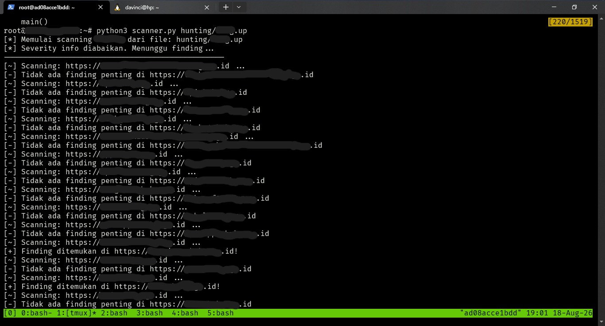
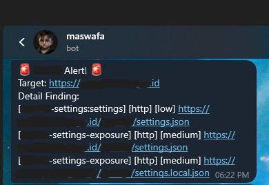
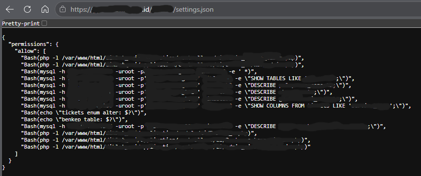
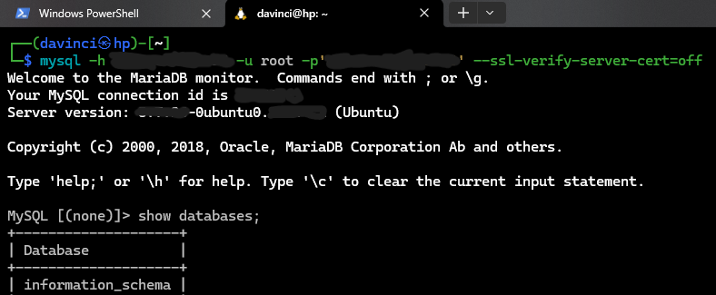

Kadang-kadang, temuan kritikal tidak didapatkan dari teknik eksploitasi yang rumit, tapi dari kesalahan konfigurasi sederhana.

Artikel ini membagikan keisengan saya ketika _berburu serangga_ dengan skrip otomatis yang berjalan di VPS dan berhasil menemukan file konfigurasi sensitif yang memuat kredensial database secara plaintext dan berujung pada akses penuh.

Untuk menangani target dengan scope wildcard (*.target.id), memantau aset secara manual sangat tidak efisien. Saya menggunakan sebuah VPS untuk menjalankan proses di background agar pemindaian bisa berjalan secara penuh tanpa mengandalkan perangkat lokal. Alur secara keseluruhan kira-kira seperti berikut:

1. Mengumpulkan subdomain
2. Filter subdomain yang aktif
3. Scan dengan skrip otomatis
4. Kirim temuan ke telegram

---

## Proses Pemindaian

Singkat cerita, setelah subdomain terkumpul dilakukan pemindaian otomatis dengan skrip yang saya rancang bersama rekan saya (Gemini :V) yang dikombinasikan dengan tools scanning otomatis.

Skrip ini melakukan scanning ke seluruh subdomain satu-per-satu, jadi akan memakan waktu yang cukup lama (apalagi jika subdomain-nya ada ratusan, atau bahkan ribuan). Biarkan proses pemindaian berjalan di background, pantau hasilnya lewat telegram.

## Temuan Tidak Terduga

Setelah menunggu agak lama, ada beberapa notifikasi yang masuk, beberapa tidak terlalu penting dan beberapa yang lain dampaknya low, jadi saya abaikan (karena tidak ada bounty-nya :V).

Ada 1 notifikasi dari salah satu subdomain yang menunjukkan adanya file konfigurasi yang bisa diakses secara publik (`settings.json`):

Setelah di cek, isinya daftar perintah sistem yang mengekspos struktur direktori internal server, dan yang paling parah adalah perintah _mysql_ dengan ip publik, lengkap dengan username dan password-nya.

Setelah itu apa? tentu saja langsung saya coba :V, dan.. boom...! **Akses penuh** ke basis data sebagai pengguna root.

## Dampak

1. Kredensial root/admin database terpapar
2. Penyerang mendapatkan informasi struktur direktori internal
3. Akses penuh ke sistem basis data

Temuan ini membuktikan bahwa otomatisasi pemindaian menggunakan VPS dan integrasi alert instan seperti Telegram sangat membantu dalam mendeteksi celah secara cepat. Teknik otomatisasi ini biasanya hanya saya pakai untuk web yang menyediakan program VDP (_Vulnerability Disclosure Program_). 

---

> Sedikit informasi bahwa kesalahan konfigurasi yang saya temukan berkaitan dengan penggunaan AI oleh programmernya. Konfigurasi bisa terekspos ke publik entah karena kesalahan manusia atau AI-nya. Intinya penggunaan AI tetap perlu review manual.
