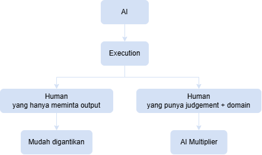

Kira-kira seperti itu pertanyaan saya ke ChatGPT. Dulu nilai seorang programmer, analis, penulis, atau designer banyak berasal dari kemampuannya *mengerjakan*. Ketika AI bisa mengerjakan bagian tersebut dengan cepat dan murah, sumber nilai manusia bergeser ke kemampuan **menentukan apa yang harus dikerjakan, mengapa, bagaimana memvalidasinya, dan siapa yang bertanggung jawab atas hasilnya**.

Ini sejalan dengan tren yang terlihat sekarang. WEF menempatkan analytical thinking sebagai core skill teratas, sementara AI & big data, cybersecurity, dan technological literacy termasuk skill yang pertumbuhannya paling cepat. ([World Economic Forum][1]) Microsoft juga melaporkan pada 2026 bahwa pengguna AI sendiri menilai quality control terhadap output AI dan critical thinking sebagai kemampuan manusia yang semakin penting. ([Microsoft][2])

## Jadi, kemampuan apa yang membuat manusia tetap bernilai?

Saya akan membaginya menjadi **8 kemampuan**, dan urutannya sengaja bukan berdasarkan “mana paling keren”, melainkan berdasarkan bagaimana nilai ekonomi manusia kemungkinan bergeser.

### 1. Problem selection — kemampuan memilih masalah yang layak diselesaikan

Ini mungkin yang paling penting.

AI sangat bagus ketika diberikan:

> “Buatkan X.”

Tetapi dunia nyata lebih sering bertanya:

> “Sebenarnya kita harus membuat apa?”

Contoh sederhana:

AI bisa membuat website dalam beberapa menit.

Tetapi seseorang tetap harus menentukan:

* siapa penggunanya?
* masalah apa yang sebenarnya mereka alami?
* apakah mereka mau membayar?
* solusi ini menyelesaikan akar masalah atau hanya gejala?
* apa konsekuensi jika solusi tersebut salah?

Jadi nilai bergeser dari **solution generation → problem formulation**.

Orang yang hanya bisa menjalankan instruksi AI akan semakin mudah digantikan.

Orang yang bisa menemukan **masalah yang tepat** justru menjadi semakin penting.

### 2. Judgment — kemampuan mengambil keputusan ketika jawabannya tidak pasti

AI dapat menghasilkan 10 alternatif.

Manusia harus memilih:

> “Yang mana yang masuk akal?”

Ini jauh lebih sulit daripada menghasilkan jawaban.

Misalnya dalam cybersecurity, AI bisa mengatakan:

> “Endpoint ini berpotensi IDOR.”

Tetapi security engineer tetap perlu menentukan:

* benar-benar vulnerable atau false positive?
* exploitability-nya bagaimana?
* data apa yang bisa diakses?
* siapa yang terdampak?
* apakah ini critical atau hanya informational?
* apakah mitigasinya realistis?
* apakah vulnerability tersebut bisa dieksploitasi dalam konteks sistem sebenarnya?

AI dapat membantu analisis.

**Keputusan akhirnya tetap memiliki konteks, risiko, dan konsekuensi.**

Microsoft menemukan bahwa 86% pengguna AI yang mereka survei memperlakukan output AI sebagai titik awal, bukan jawaban final, dan tetap mempertahankan tanggung jawab atas reasoning mereka. ([Microsoft][2])

Jadi kemampuan penting ke depan bukan:

> “Saya bisa mendapatkan jawaban dari AI.”

tetapi:

> **“Saya tahu kapan jawaban AI salah.”**

### 3. Domain expertise — benar-benar memahami bidangnya

Ada paradoks menarik:

> **Semakin pintar AI, semakin berharga orang yang memahami konteks domain.**

Misalnya:

> AI + orang yang tidak memahami jaringan
→ bisa menghasilkan konfigurasi yang terlihat benar.
>
> AI + network engineer
→ bisa menghasilkan arsitektur yang mempertimbangkan topology, failure mode, latency, security boundary, dan operational reality.
>
> AI + dokter
→ berbeda dengan AI + orang yang membaca hasil pencarian medis.
>
> AI + pentester berpengalaman
→ berbeda dengan AI + orang yang hanya menjalankan scanner.

Karena AI semakin mampu menghasilkan output, manusia tidak harus menjadi orang yang menghasilkan setiap output.

Tetapi manusia harus mampu **memahami, memeriksa, dan mengintegrasikan output tersebut ke dunia nyata.**

### 4. AI orchestration — kemampuan mengelola AI, bukan sekadar menggunakan AI

Ini menurut saya akan menjadi skill yang sangat penting.

Banyak orang sekarang berpikir:

> “Saya bisa prompt ChatGPT.”

Itu mungkin akan menjadi kemampuan dasar.

Yang lebih bernilai adalah:

> **“Saya bisa membuat 10 AI agent bekerja sebagai sebuah sistem.”**

Manusia tidak perlu melakukan seluruh pekerjaan manual.

Tetapi manusia:

* menentukan workflow
* menentukan batasan
* menentukan tools
* menentukan kapan agent boleh bertindak
* memeriksa hasil
* menangani exception
* mengambil keputusan akhir

Microsoft bahkan menggambarkan munculnya peran semacam **“agent boss”**—orang yang mendelegasikan pekerjaan kepada agent dan mengelolanya. ([The Official Microsoft Blog][3])

Jadi kemungkinan besar akan ada pergeseran:

**worker → AI-assisted worker → AI orchestrator → AI system architect**

### 5. Taste — kemampuan mengetahui apa yang “bagus”

Ini sering diremehkan.

AI bisa menghasilkan:

* 100 desain logo
* 50 artikel
* 20 landing page
* 30 ide startup
* 10 arsitektur software

Tetapi menghasilkan banyak pilihan justru menciptakan masalah baru:

> **Mana yang benar-benar bagus?**

Taste adalah kemampuan untuk membedakan:

* biasa vs luar biasa
* generic vs distinctive
* technically correct vs actually useful
* terlihat bagus vs benar-benar efektif

Di dunia yang dipenuhi konten AI, **konten menjadi berlimpah tetapi perhatian manusia tetap terbatas.**

Karena itu kemampuan kurasi dan taste bisa semakin bernilai.

### 6. Human trust — kemampuan membuat orang percaya dan mau bekerja sama

Ada pekerjaan yang output-nya tidak cukup hanya “benar”.

Orang juga harus percaya kepada orang yang memberikan output tersebut.

Contohnya:

* sales
* leadership
* consulting
* negotiation
* security consulting
* management
* teaching
* entrepreneurship

Bayangkan dua pentester menemukan vulnerability yang sama.

Pentester A:

> “Ada SQL injection.”

Pentester B:

> “Kami menemukan SQL injection pada endpoint X. Vulnerability ini memungkinkan akses database tanpa autentikasi. Berdasarkan data yang dapat diakses, dampaknya mencakup customer records. Kami sudah memvalidasi exploit pada environment staging. Berikut remediation dan prioritas perbaikannya.”

Secara teknis mungkin AI bisa menghasilkan laporan keduanya.

Tetapi ketika harus:

> berbicara dengan CTO, developer, CEO, atau client,

nilai manusia muncul melalui **trust, komunikasi, dan accountability**.

WEF juga masih menempatkan leadership, social influence, empathy, active listening, dan customer service sebagai core skills. ([World Economic Forum][1])

### 7. Accountability — keberanian dan kemampuan memiliki konsekuensi

Ini menurut saya salah satu batas yang sangat penting.

Bayangkan AI mengatakan:

> “Deploy sekarang.”

Tetapi deployment menyebabkan outage.

Siapa yang bertanggung jawab?

Atau:

AI menyarankan:

> “Ini vulnerability critical.”

Tetapi ternyata false positive dan perusahaan menghabiskan jutaan rupiah untuk remediation yang tidak diperlukan.

Dalam banyak situasi bisnis, seseorang tetap perlu mengatakan:

> **“Saya bertanggung jawab terhadap keputusan ini.”**

AI tidak menghilangkan kebutuhan akan accountability.

Justru ketika automation semakin besar, kebutuhan terhadap orang yang **memiliki keputusan dan hasil akhirnya** bisa semakin besar.

### 8. Adaptability — kemampuan belajar lebih cepat daripada perubahan

Ini mungkin terdengar klise, tetapi dalam era AI maknanya berubah.

Dulu:

> belajar skill → menggunakan skill selama bertahun-tahun.

Sekarang:

> belajar → teknologi berubah → workflow berubah → belajar lagi.

WEF memperkirakan sekitar **39% skill yang ada saat ini akan berubah atau menjadi usang antara 2025–2030**, dan curiosity/lifelong learning serta resilience/flexibility/agility termasuk skill yang diperkirakan terus meningkat pentingnya. ([World Economic Forum][4])

Jadi career advantage bukan lagi hanya:

> “Saya paling pintar.”

Tetapi:

> **“Saya paling cepat beradaptasi ketika lingkungan berubah.”**

---

## Tetapi ada sesuatu yang lebih fundamental

Kalau saya sederhanakan seluruh perubahan ini:

### Era sebelum AI

> Information = scarce
> 
> Execution   = expensive
> 
> Human labor = valuable

### Era AI

> Information = abundant
>
> Execution   = cheap
>
> Intelligence = increasingly abundant

Maka sesuatu yang sebelumnya murah tetapi sekarang menjadi langka akan menjadi lebih bernilai.

Dan yang semakin langka justru:

- Good questions
- Good judgment
- Context
- Trust
- Taste
- Responsibility
- Relationships
- Real-world access
- Original insight

Itulah sebabnya saya tidak terlalu percaya pada strategi:

> **“Saya harus mencari pekerjaan yang AI tidak bisa lakukan.”**

Karena kita tidak tahu batas AI lima atau sepuluh tahun dari sekarang.

Strategi yang lebih tahan lama adalah:

> **“Saya harus menjadi orang yang nilainya meningkat ketika AI semakin kuat.”**

---

## Saya akan merumuskan manusia masa depan seperti ini

Bukan:

> **Human vs AI**

melainkan:

> **Human + AI vs Human tanpa AI**

Dan di antara manusia yang menggunakan AI pun akan muncul perbedaan besar.

Orang yang hanya bersaing pada **kecepatan menghasilkan output** akan menghadapi tekanan besar.

Orang yang bersaing pada **kualitas keputusan dan kemampuan mengarahkan sistem** justru dapat menggunakan AI sebagai pengungkit.

Microsoft pada 2026 bahkan menggambarkan perubahan ini sebagai AI mengambil lebih banyak bagian “execution”, sementara manusia mendapatkan lebih banyak ruang untuk mengarahkan pekerjaan, membuat keputusan, dan memiliki outcome. ([Microsoft][2])

## Jadi kalau saya harus memilih satu kemampuan paling penting:

**Judgment.**

Bukan karena judgment adalah “skill manusia yang AI tidak akan pernah punya”—kita tidak bisa memastikan itu.

Tetapi karena selama AI semakin murah untuk **menghasilkan jawaban**, nilai akan semakin berpindah kepada orang yang mampu:

> **menentukan pertanyaan yang tepat → mengarahkan AI → memeriksa hasilnya → memahami konteks → mengambil keputusan → bertanggung jawab atas akibatnya.**

Dan ada konsekuensi yang cukup menarik:

**AI mungkin tidak membuat manusia tidak berguna. AI membuat manusia yang hanya berguna karena bisa “mengerjakan tugas” menjadi jauh lebih mudah tergantikan.**

Sebaliknya, manusia yang menjadi **pemilik masalah, pemilik keputusan, dan perancang sistem** justru mempunyai leverage yang jauh lebih besar.

[1]: https://www.weforum.org/publications/the-future-of-jobs-report-2025/in-full/3-skills-outlook/ "3. Skills outlook - The Future of Jobs Report 2025 | World Economic Forum"
[2]: https://www.microsoft.com/en-us/worklab/work-trend-index/agents-human-agency-and-the-opportunity-for-every-organization "2026 Work Trend Index report: Agents, human agency, and opportunity"
[3]: https://blogs.microsoft.com/blog/2025/04/23/the-2025-annual-work-trend-index-the-frontier-firm-is-born/ "The 2025 Annual Work Trend Index: The Frontier Firm is born - The Official Microsoft Blog"
[4]: https://www.weforum.org/publications/the-future-of-jobs-report-2025/digest/ "The Future of Jobs Report 2025 | World Economic Forum"
[5]: https://metr.org/time-horizons/ "Task-Completion Time Horizons of Frontier AI Models - METR"
